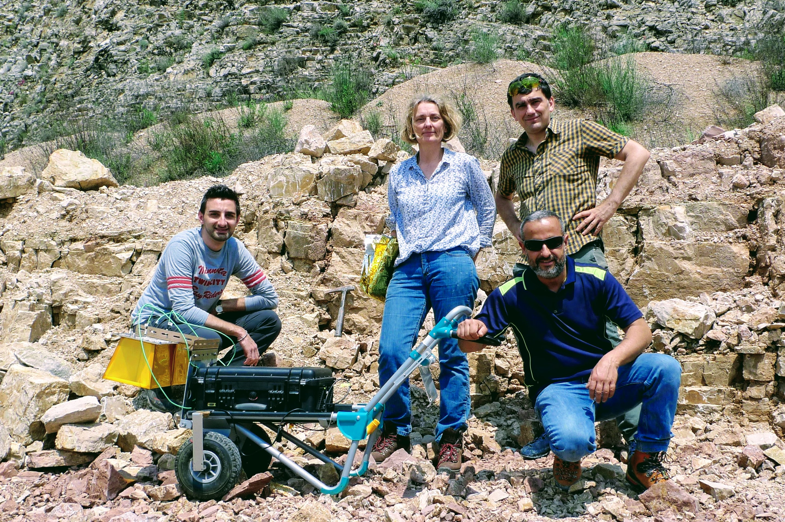

PERUGIA. Lo scorso 9 Maggio 2018 presso la cava Marinelli di Mantignana si sono svolti dei test di misure geofisiche da parte 
dei ricercatori che stanno preparando la prossima missione su Marte dell'Agenzia Spaziale Europea e Russa: ExoMars. Lo scopo 
della missione è di cercare tracce di vita nel sottosuolo del pianeta.
La cava di calcare di Mantignana è stato lo scenario di una campagna di misure utili agli esperimenti WISDOM e MA_MISS, 
il radar e lo spettrometro a bordo del rover di ExoMars che esplorerà la superficie marziana.  Il radar WISDOM utilizza le onde 
radio per indagare il sottosuolo generando immagini simili alle comuni radiografie, mentre lo spettrometro MA_MISS fornirà 
la composizione mineralogica del sottosuolo, operando all'interno della piccola trivella che perforerà la superficie di Marte.
La Professoressa Valerie Ciarletti del LATMOS di Parigi, responsabile dell'esperimento WISDOM ed il Dottor Alessandro Frigeri dell'Istituto di
Astofisica e Planetologia Spaziali di Roma, geologo del team scientifico di MA_MISS, hanno effettuato parte delle prove che 
permetteranno di integrare i dati scientifici che verranno trasmessi da Marte una volta che la missione sarà operativa, nel 2020.
I due ricercatori della missione ExoMars sono stati accompagnati da due esperti locali di misure geofisiche, il Dottor Massimiliano Mazzocca 
dello studio GeoPro ed il Dottor Maurizio Ercoli dell'Università di Perugia.
"Sono diversi anni che ospitiamo con piacere le attività scientifiche e didattiche dell'Università, ed è una grande 
soddisfazione aver potuto supportare le attività che ci preparano alla prossima missione scientifica su Marte", ha commentato la 
responsabile dell'attività estrattiva, Marianna Marinelli.

  
  
 

Il team di ricercatori al lavoro nella cava Marinelli di Mantignana

  

